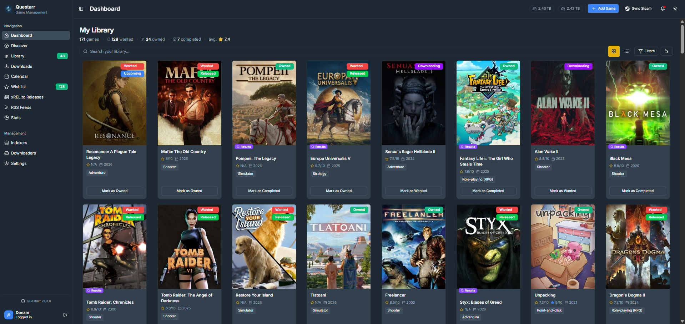
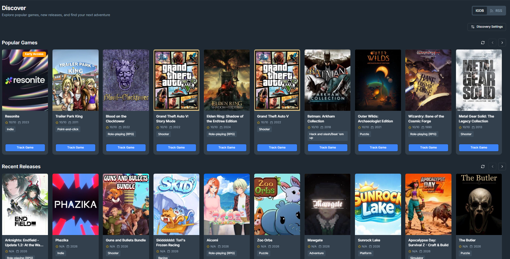
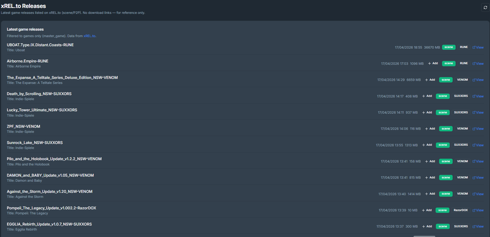
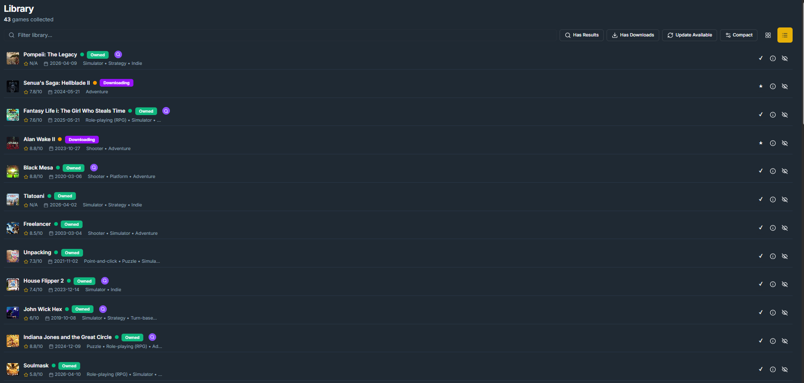
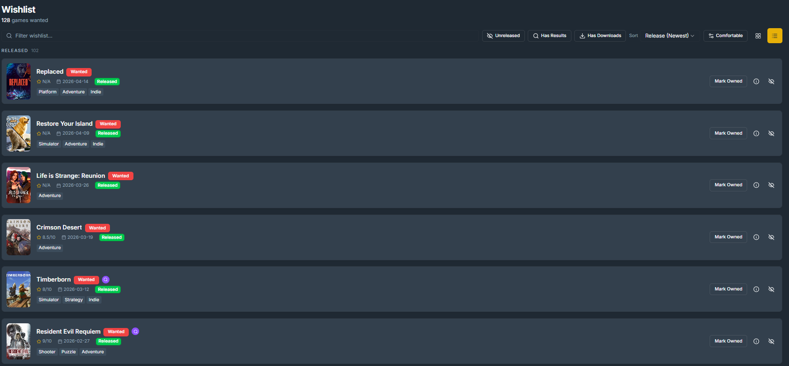
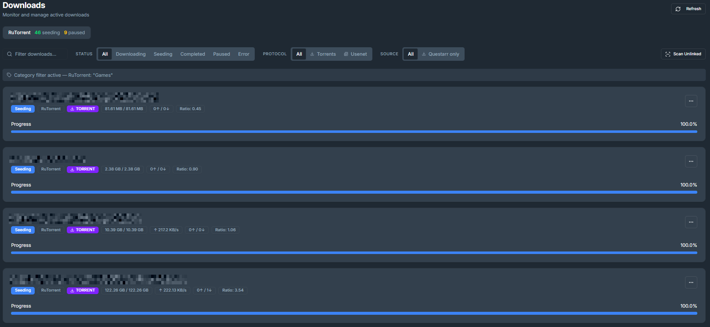
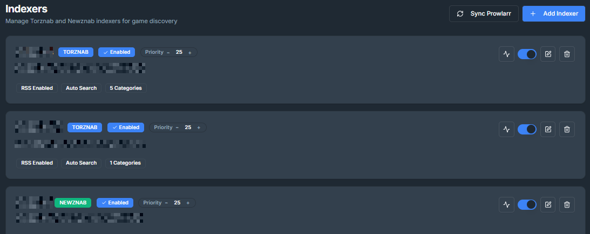
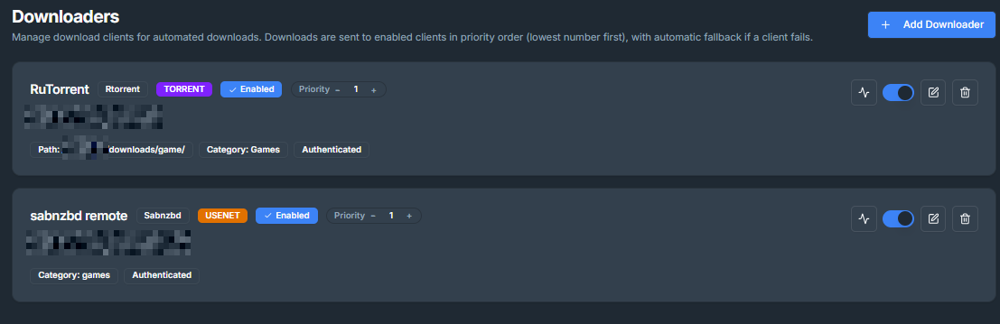
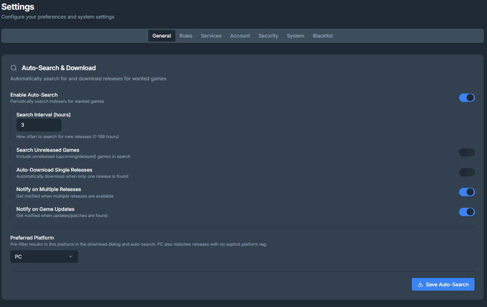

<div align="center">
  

  <p>
    A video game management application inspired by the -Arr apps (Sonarr, Radarr, Prowlarr...) and GamezServer. Track and organize your video game collection with automated discovery and download management.
  </p>

  <p>
    <a href="https://hub.docker.com/r/doezer/questarr">
      
    </a>
    <a href="https://github.com/Doezer/Questarr/pkgs/container/questarr">
      
    </a>
    <a href="https://github.com/Doezer/Questarr/blob/main/COPYING">
      
    </a>
    <a href="https://github.com/Doezer/Questarr/actions/workflows/ci.yml">
      
    </a>
    <a href="https://codecov.io/gh/Doezer/Questarr">
      
    </a>
  </p>

  <p>
    <a href="https://discord.gg/STkp86wP9F">
      
    </a>
    <a href="https://buymeacoffee.com/doezer">
      
    </a>
  </p>
</div>

## Features

- **🎮 Game Discovery**: Browse popular games, new releases, and upcoming titles via IGDB integration and xREL.to.
- **📚 Library Management**: Track your game collection with status indicators (Wanted, Owned, Playing, Completed).
<!-- v1.2.0 only - **☁️ Steam Integration**: Sync your Steam wishlist and import your library automatically. -->
- **⬇️ Download Management**: Integrate with indexers (Prowlarr/Torznab/Newsznab), torrent/usenet downloaders (qBittorrent, Transmission, rTorrent / sabnzbd, nzbget), and optionally enable auto-download to get them right when they're there.
- **🔍 Search & Filter**: Find games by genre, platform, and search terms. Automatically search for added games until available on your indexers.
- **📰 RSS Feeds**: Monitor releases from your favorite groups directly within the app.
- **🔒 Privacy Focused**: No external dependencies (Google Fonts removed) and hardened security (CSP, SSRF protection).
- **✨ Clean Interface**: UI optimized for browsing game covers and metadata, with light/dark mode.

## Screenshots

<details open>
<summary><b>👀 See the app in action</b></summary>

### Dashboard

Your central hub for recent activity, collection overview and downloading available games.
[](images/Screenshots/dashboard.png)
[](images/Screenshots/download_modal.png)

### Discover Games

Browse and find new games to add to your collection.

<p float="left">
  <a href="images/Screenshots/discover.png"></a>
  <a href="images/Screenshots/xrelto.png"></a> 
</p>

### Library & Wishlist

Manage your wanted and owned games.

<p float="left">
  <a href="images/Screenshots/library.png"></a>
  <a href="images/Screenshots/wishlist.png"></a> 
</p>

### Calendar

Keep track of upcoming releases.
[](images/Screenshots/calendar.png)

### Downloads Queue (WIP)

Monitor your downloaders' active downloads and history.
[](images/Screenshots/downloads.png)

### Settings

Configure indexers, downloaders, and application preferences.

<p float="left">
  <a href="images/Screenshots/indexers.png"></a>
  <a href="images/Screenshots/downloaders.png"></a> 
</p>

[](images/Screenshots/settings.png)

</details>

## Tech Stack

<div align="center">
  <p>
    
    
    
    
    
    
  </p>
</div>

- **Frontend**: React 18, TypeScript, Vite, Tailwind CSS, shadcn/ui
- **Backend**: Node.js, Express, TypeScript
- **Database**: SQLite with Drizzle ORM
- **APIs**: IGDB (game metadata), Torznab (indexer search)<!-- v1.2.0 only - , Steam API (user library sync)-->
- **AIs**: Claude Sonnet 4.5, Gemini 3, Google Jules, GitHub Copilot

## Installation

### Using Docker (Recommended)

Docker is the easiest way to deploy Questarr with all dependencies included. Questarr uses a SQLite database which is self-contained in the application container.

#### Fresh Install

**Option 1: One-liner (Simplest)**

```bash
docker run -d -p 5000:5000 -v ./data:/app/data --name questarr ghcr.io/doezer/questarr:latest
```

**Option 2: Docker Compose**

1. **Create a `docker-compose.yml` file:**

   ```yaml
   services:
     app:
       image: ghcr.io/doezer/questarr:latest
       ports:
         - "5000:5000"
       volumes:
         - ./data:/app/data
       environment:
         - SQLITE_DB_PATH=/app/data/sqlite.db
       restart: unless-stopped
   ```

2. **Start the application:**

   ```bash
   docker compose up -d
   ```

3. **Access the application:**
   Open your browser to `http://localhost:5000`

#### Upgrading from v1.0 (PostgreSQL)

If you are upgrading from an older version that used PostgreSQL, you need to migrate your data.

1.  **Stop your current application:**

    ```bash
    docker compose down
    ```

2.  **Get the migration tools:**
    Download the [`docker-compose.migrate.yml`](https://raw.githubusercontent.com/Doezer/Questarr/main/docker-compose.migrate.yml) file to your directory.

3.  **Run the migration:**
    This command spins up your old database and converts the data to the new format automatically.

    ```bash
    docker compose -f docker-compose.migrate.yml up --abort-on-container-exit
    ```

4.  **Update your deployment:**
    Replace your `docker-compose.yml` with the new version (see "Fresh Install" above).

5.  **Start the new version:**
    ```bash
    docker compose up -d
    ```

See [docs/MIGRATION.md](docs/MIGRATION.md) for more details.

## Configuration

1. **First-time setup:**

- Create your admin account
- Configure the IGDB credentials
- Connect your Steam account (Optional)

Once logged-in:

- Configure indexers
- Add downloaders
- Add games!

See [Configuration on the Wiki](https://github.com/Doezer/Questarr/wiki/Configuring-the-application#configure-app-behavior-in-settings--general) for more detailed info.

<details>
<summary><b>Getting IGDB API Credentials</b></summary>

IGDB provides game metadata (covers, descriptions, ratings, release dates, etc.).

1. Go to [Twitch Developer Console](https://dev.twitch.tv/console)
2. Log in with your Twitch account (create one if needed)
3. Click "Register Your Application"
4. Fill in:
   - **Name**: Questarr (or any name)
   - **OAuth Redirect URLs**: `http://localhost` (not used, but required)
   - **Category**: Application Integration
5. Click "Create"
6. Copy your **Client ID** and **Client Secret**
7. Add them to your `.env` file

</details>

<details>
<summary><b>Advanced usage</b></summary>

### Docker compose

This is mainly for users who want the latest commit (e.g when trying out fixes for an issue) or contributing users.

1. **Clone the repository:**

```bash
git clone https://github.com/Doezer/Questarr.git
cd Questarr
```

1. **Configure the application:**
   Edit `docker-compose.yml` directly if you need to setup a specific environment.

1. **Build and start the containers:**

```bash
docker-compose up -d
```

1. **Access the application:**
   Open your browser to `http://localhost:5000`

### **Update to latest version for Docker**

Your database content will be kept.

```bash
git pull
docker-compose down
docker-compose build --no-cache
docker-compose up -d
```

### Manual Installation (npm) - NOT RECOMMENDED

For development or custom deployments without Docker.

1. **Clone and install dependencies:**

```bash
git clone https://github.com/Doezer/Questarr.git
npm install
```

2. **Configure environment variables in `.env`:**
   See the .env.example for available variables.

3. **Initialize the database:**
   This will run available migration files.

```bash
npm run db:migrate
```

5. **Development mode (with hot reload):**

```bash
npm run dev
```

6. **Access the application:**
   Open your browser to `http://localhost:5000`

</details>

## Troubleshooting

See [Troubleshooting on the Wiki](https://github.com/Doezer/Questarr/wiki/Troubleshooting)

### Getting Help

- **Issues**: [GitHub Issues](https://github.com/Doezer/Questarr/issues)
- **Discussions**: [GitHub Discussions](https://github.com/Doezer/Questarr/discussions)
- **Discord**: [Join our Server](https://discord.gg/STkp86wP9F)

## Contributing

See [.github/CONTRIBUTING.md](.github/CONTRIBUTING.md) for guidelines on how to contribute to this project.

## Contributors

<a href="https://github.com/Doezer/Questarr/graphs/contributors">
  
</a>

Made with [contrib.rocks](https://contrib.rocks).

## License

GPL3 License - see [COPYING](COPYING) file for details.

## Acknowledgments

- Inspired by [Sonarr](https://sonarr.tv/) and [GamezServer](https://github.com/05sonicblue/GamezServer)
- Game metadata powered by [IGDB API](https://www.igdb.com/)
- UI components from [shadcn/ui](https://ui.shadcn.com/)
