# Questarr


A video game management application inspired by the -Arr apps (Sonarr, Radarr, Prowlarr...) and GamezServer. Track and organize your video game collection with automated discovery and download management.

[](https://hub.docker.com/r/doezer/questarr)
[](https://github.com/Doezer/Questarr/pkgs/container/questarr)
[](https://github.com/Doezer/Questarr/blob/main/COPYING)
[](https://github.com/Doezer/Questarr/releases)
[](https://github.com/Doezer/Questarr/releases)
[](https://github.com/Doezer/Questarr/commits/main)

[](https://sonarcloud.io/summary/overall?id=Doezer_Questarr)
[](https://sonarcloud.io/summary/overall?id=Doezer_Questarr)
[](https://sonarcloud.io/summary/overall?id=Doezer_Questarr)
[](https://www.bestpractices.dev/projects/13450)
[](https://www.bestpractices.dev/projects/13450)

[](https://github.com/Doezer/Questarr/actions/workflows/ci.yml)
[](https://codecov.io/gh/Doezer/Questarr)
[](https://github.com/Doezer/Questarr/security/code-scanning)
[](https://github.com/Doezer/Questarr/actions/workflows/ci.yml)
[](https://github.com/Doezer/Questarr/graphs/commit-activity)

⭐ Star us on GitHub — your support motivates us a lot! 🙏😊

[](https://discord.gg/STkp86wP9F)
[](https://x.com/intent/tweet?text=Check%20out%20this%20project%20on%20GitHub:%20https://github.com/Doezer/Questarr%20%23gaming%20%23selfhosted)
[](https://www.facebook.com/sharer/sharer.php?u=https://github.com/Doezer/Questarr)
[](https://www.linkedin.com/sharing/share-offsite/?url=https://github.com/Doezer/Questarr)
[](https://www.reddit.com/submit?title=Check%20out%20this%20project%20on%20GitHub:%20https://github.com/Doezer/Questarr)
[](https://t.me/share/url?url=https://github.com/Doezer/Questarr&text=Check%20out%20this%20project%20on%20GitHub)
[](https://buymeacoffee.com/doezer)

[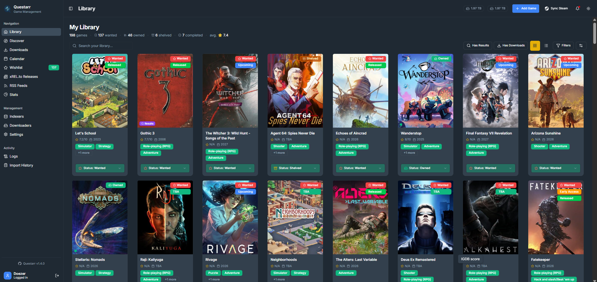](images/Screenshots/library.png)

## Table of Contents

- [Questarr](#questarr)
  - [Table of Contents](#table-of-contents)
  - [List of features](#list-of-features)
  - [Installation](#installation)
  - [Screenshots](#screenshots)
  - [Tech Stack](#tech-stack)
  - [Configuration](#configuration)
  - [Roadmap](#roadmap)
  - [Troubleshooting](#troubleshooting)
  - [Project Security \& Documentation](#project-security--documentation)
  - [Contributing](#contributing)
  - [License](#license)
  - [Acknowledgments](#acknowledgments)
  - [Star History](#star-history)

## List of features

| Feature                     | Description                                                                                                                                                                   |
| --------------------------- | ----------------------------------------------------------------------------------------------------------------------------------------------------------------------------- |
| **Backlog management**      | Track your collection with status indicators (Wanted, Owned, Playing, Completed, Shelved), ratings, and notes.                                                                |
| **Game Discovery**          | Browse popular, new, and upcoming titles via IGDB, RSS feeds, and xREL.to, or sync your Steam wishlist directly into the app.                                                 |
| **Search & Filter**         | Find games by genre, platform, and keyword, with automatic search until a release is found, plus release blacklisting and preferred release groups/platforms.                 |
| **Download Management**     | Integrates with indexers and downloaders with optional auto-download and automatic post-processing import.                                                                    |
| **Real-time Notifications** | In-app alerts for releases and downloads, plus external notifications to 100+ providers via [Apprise](https://github.com/caronc/apprise).                                     |
| **Rich Game Metadata**      | Details enriched with IGDB, Steam, PCGamingWiki, and NexusMods, including trending mods where available.                                                                      |
| **Statistics**              | Visualize collection statistics with Discord sharing support. 🚧                                                                                                              |
| **Security Focused**        | General security hardening, SSL support, and [OpenSSF certified](https://www.bestpractices.dev/projects/13450) — see [SECURITY.md](.github/SECURITY.md) for the full process. |
| **Integrations**            | Deployable on UNRAID and as a Home Assistant add-on. 🚧                                                                                                                       |
| **Design**                  | Clean, minimalist, dark-first UI built with mobile usage in mind.                                                                                                             |

### Supported Indexers/Downloaders

- Prowlarr synchronization is supported to add all your indexers at once.
- G4u.to: the site offers an API to VIP members, which can be used in Questarr.

| Indexers                   | Downloaders                                                                             |
| -------------------------- | --------------------------------------------------------------------------------------- |
| Torznab protocol (Torrent) | - qBittorent<br>- Transmission<br>- rTorrent<br>- Deluge<br>- Synology Download Station |
| Newznab protocol (Usenet)  | - Sabnzbd<br>- Nzbget                                                                   |
| G4U.to                     | Same as Newznab                                                                         |

## Installation

Docker is the easiest way to deploy Questarr with all dependencies included. Questarr uses a SQLite database which is self-contained in the application container.

### Option 1: One-liner (Simplest but minimal)

```bash
docker run -d -p 5000:5000 -v ./data:/app/data --name questarr ghcr.io/doezer/questarr:latest
```

### Option 2: Docker Compose (more detailed)

1. **Use the [`docker-compose.yml`](https://github.com/Doezer/Questarr/blob/main/docker-compose.yml) file from the repo or create a minimal one:**

   ```yaml
   services:
     app:
       image: ghcr.io/doezer/questarr:latest
       ports:
         - "5000:5000"
       volumes:
         - ./data:/app/data
       environment:
         - SQLITE_DB_PATH=/app/data/sqlite.db
       restart: unless-stopped
   ```

2. **Start the application:**

   ```bash
   docker compose up -d
   ```

3. **Access the application:**
   Open your browser to `http://localhost:5000`

### UNRAID

<details>
<summary><b>Install via Community Applications</b></summary>

Questarr ships an official Community Applications template ([`unraid/questarr.xml`](unraid/questarr.xml)):

1. In the UNRAID web UI, open the **Apps** tab and search for **Questarr**.
2. If it doesn't show up there yet, go to **Docker → Add Container**, enable **Template repositories**, and a
   dd:
   `https://raw.githubusercontent.com/Doezer/Questarr/main/unraid/questarr.xml`
3. Set your **Data Path** (default `/mnt/user/appdata/questarr`), **PUID**/**PGID**, and ports (default `5000
` HTTP, `9898` HTTPS).
4. Apply, then open `http://<unraid-host>:5000` to access the UI.

</details>

### Home Assistant Add-on

<details>
<summary><b>Install as a Home Assistant add-on</b></summary>

You can install Questarr as a Home Assistant add-on from this repository:

1. In Home Assistant, open **Settings → Add-ons → Add-on Store**.
2. Click the menu (⋮) and choose **Repositories**.
3. Add this repository URL: `https://github.com/Doezer/Questarr`
4. Install the **Questarr** add-on and start it.
5. Open `http://<home-assistant-host>:5000` to access the UI.

</details>

## Screenshots

<details closed>
<summary><b>👀 See the app in action</b></summary>

### Library

Your central hub for recent activity, collection overview and downloading available games. Manage your owned and wanted games.

<a href="images/Screenshots/library.png"></a>

<p float="left">
  <a href="images/Screenshots/game_details.png">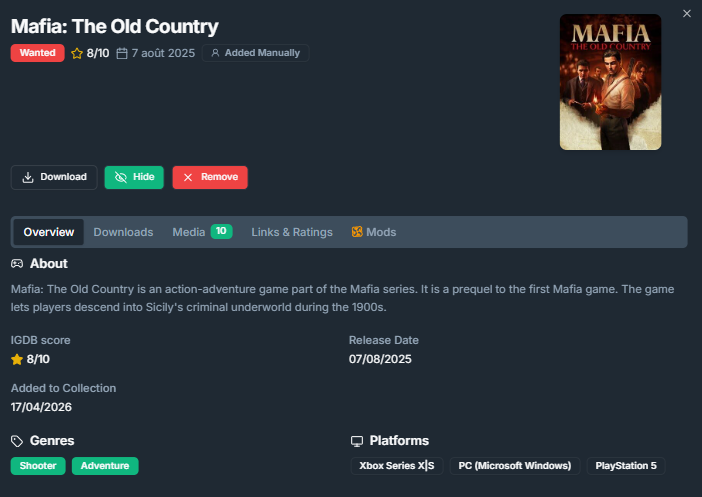</a>
  <a href="images/Screenshots/download_modal.png">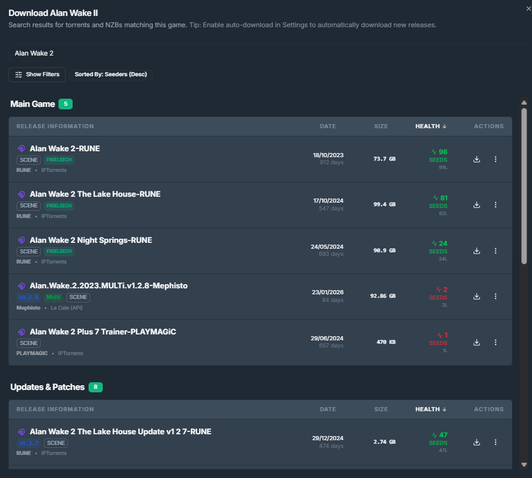</a>
</p>

### Wishlist & Release calendar

Manage your wanted games and when they release.
<p float="left">
  <a href="images/Screenshots/wishlist.png">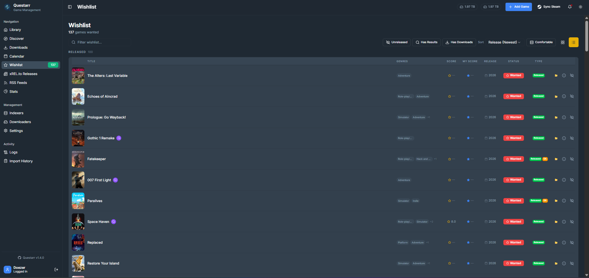</a>
  <a href="images/Screenshots/calendar.png">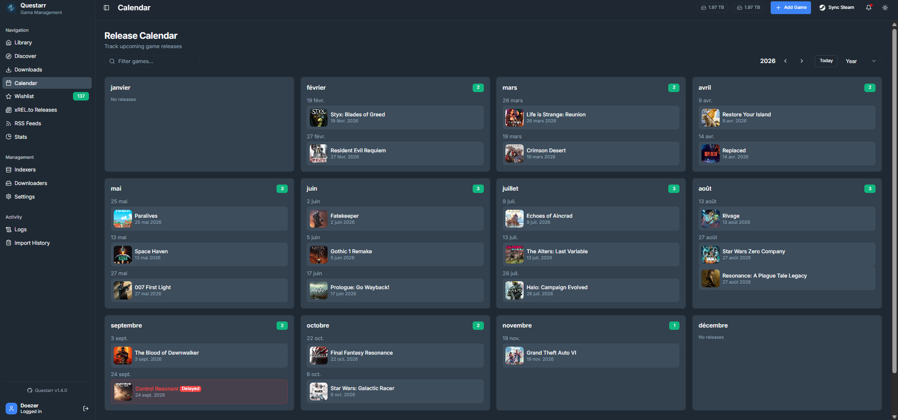</a>
</p>

### Discover Games

Browse and find new games to add to your collection.

<a href="images/Screenshots/discover.png">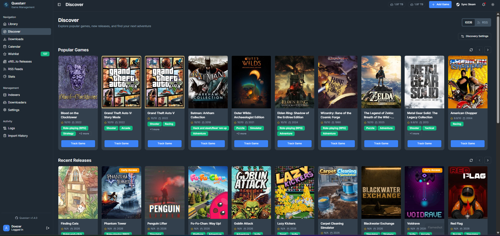</a>

#### RSS & xRel.to feeds

Custom RSS feeds and xRel.to flux matched to IGDB games directly into the app. Default RSS is set to fitgirl site.

<p float="left">
  <a href="images/Screenshots/rss.png">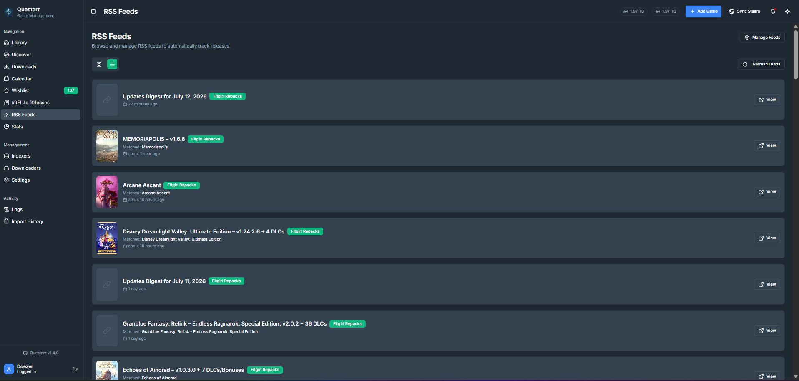</a>
  <a href="images/Screenshots/xrelto.png">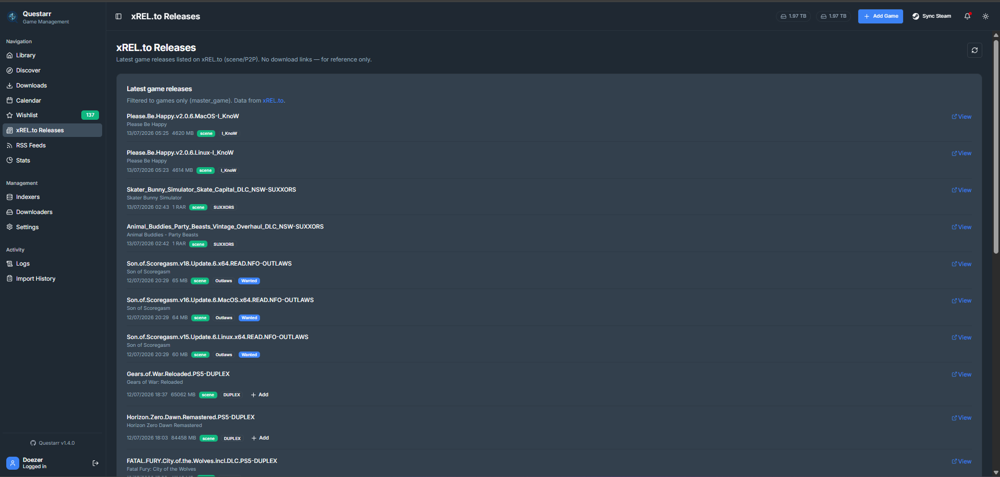</a>
</p>

### Downloads Queue

Monitor your downloaders' active downloads and history.

<a href="images/Screenshots/downloads.png">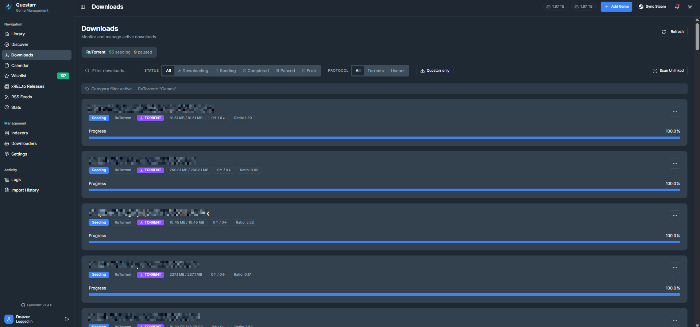</a>

### Statistics

Check out your library statistics.

<a href="images/Screenshots/stats.png">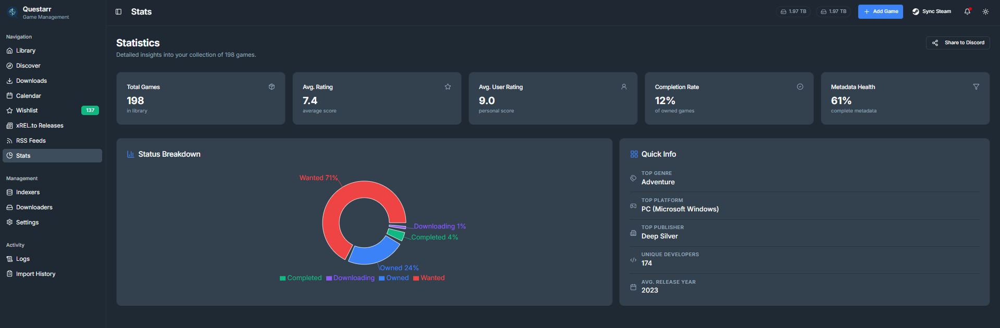</a>

### Settings

Configure indexers, downloaders, and application preferences.

<p float="left">
  <a href="images/Screenshots/indexers.png">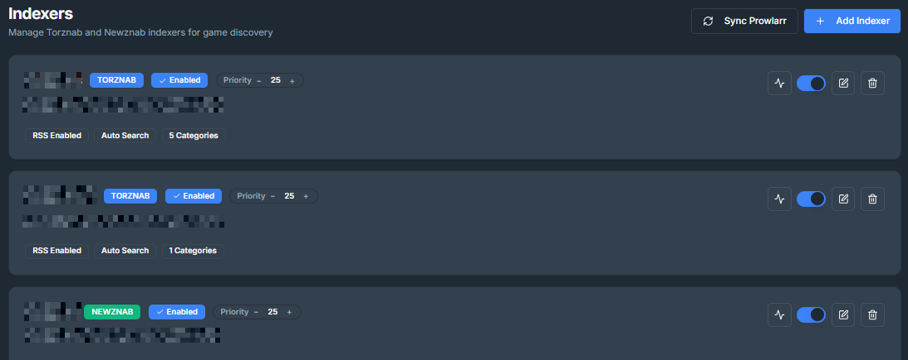</a>
  <a href="images/Screenshots/downloaders.png">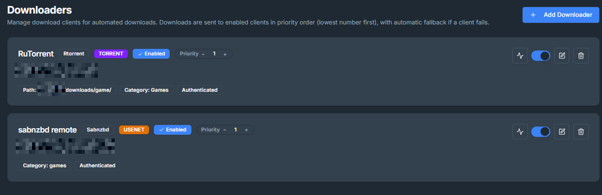</a>
</p>

<a href="images/Screenshots/settings.png">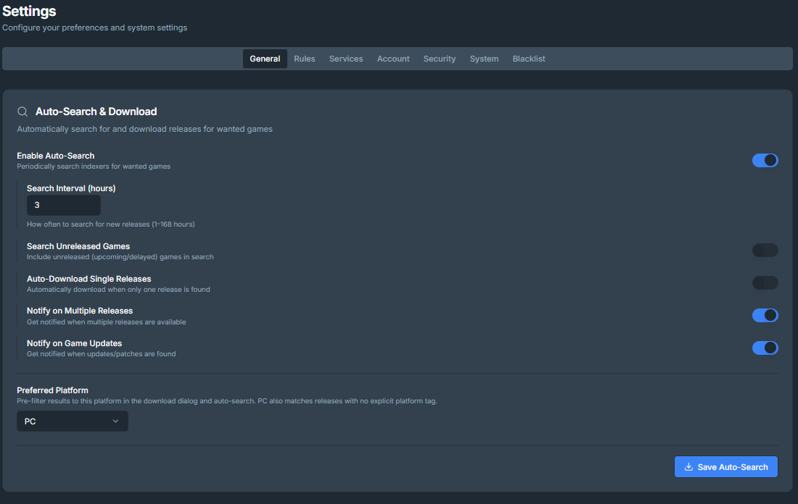</a>

</details>

## Tech Stack


[](package.json)
[](https://www.typescriptlang.org/)
[](#installation)
[](#installation)

- **APIs**: IGDB (game metadata), Torznab/Newznab (indexer search), PCGamingWiki, NexusMods, xREL.to
- **AIs usage**:
  - Claude and Github Copilot are used for AI-Assisted coding, internal code reviews, PR cleanup. Eventually automated coding and troubleshooting for small tasks and bug reports.
  - Gemini & Codex are used for automated code reviews, and brainstorming from time to time (as well as Perplexity for this usage).
  - Google Jules is used for light periodical refactoring.

## Configuration

1. **First-time setup:**

- Create your admin account
- Configure the IGDB credentials

Once logged-in:

- Configure indexers
- Add downloaders
- Add games!

See [Configuration on the Wiki](https://github.com/Doezer/Questarr/wiki/Configuring-the-application#configure-app-behavior-in-settings--general) for more detailed info.

<details>
<summary><b>Getting IGDB API Credentials</b></summary>

IGDB provides game metadata (covers, descriptions, ratings, release dates, etc.).

1. Go to [Twitch Developer Console](https://dev.twitch.tv/console)
2. Log in with your Twitch account (create one if needed)
3. Click "Register Your Application"
4. Fill in:
   - **Name**: Questarr (or any name)
   - **OAuth Redirect URLs**: `http://localhost` (not used, but required)
   - **Category**: Application Integration
5. Click "Create"
6. Copy your **Client ID** and **Client Secret**
7. Add them to your `.env` file

</details>

<details>
<summary><b>Upgrading from v1.0 (PostgreSQL)</b></summary>

If you are upgrading from an older version that used PostgreSQL, you need to migrate your data.

1. **Stop your current application:**

   ```bash
   docker compose down
   ```

2. **Get the migration tools:**
   Download the [`docker-compose.migrate.yml`](https://raw.githubusercontent.com/Doezer/Questarr/main/docker-compose.migrate.yml) file to your directory.

3. **Run the migration:**
   This command spins up your old database and converts the data to the new format automatically.

   ```bash
   docker compose -f docker-compose.migrate.yml up --abort-on-container-exit
   ```

4. **Update your deployment:**
   Replace your `docker-compose.yml` with the new version (see "Fresh Install" above).

5. **Start the new version:**

   ```bash
   docker compose up -d
   ```

See [docs/MIGRATION.md](docs/MIGRATION.md) for more details.
</details>

<details>
<summary><b>Advanced usage</b></summary>

### Docker compose

This is mainly for users who want the latest commit (e.g when trying out fixes for an issue) or contributing users.

1. **Clone the repository:**

```bash
git clone https://github.com/Doezer/Questarr.git
cd Questarr
```

1. **Configure the application:**
   Edit `docker-compose.yml` directly if you need to setup a specific environment.

1. **Build and start the containers:**

```bash
docker-compose up -d
```

1. **Access the application:**
   Open your browser to `http://localhost:5000`

### Update to latest version for Docker

Your database content will be kept.

```bash
git pull
docker-compose down
docker-compose build --no-cache
docker-compose up -d
```

</details>

## Roadmap

Based on the [Product Requirements Document](docs/PRD.md), here's what's planned over the next 6 months, in priority order:

- ✅ **P0 — Post-Processing Pipeline** : Move/copy completed downloads to a destination path, extract archives — closing the "set it and forget it" loop.
- **P1 — Smart Game Backlog**: Track the version of each downloaded game and notify (or auto-download) when a newer release shows up on indexers.
- **P2 — Direct Download Support**: Add debrid services (Real-Debrid and similar) as a downloader option, no seeding required.
- **P3 — External Library Sync**: Import owned games from Steam/GOG libraries and local filesystem scans, not just wishlists.
- **P4 — Integrations with External Tools**: Playnite, RomM, Gameyfin, and a generic webhook for anything not explicitly supported.
- **P5 — Indexer Page Links**: A "View on indexer" link on search results and downloads.
- **P6 — PostgreSQL Support**: Re-introduce PostgreSQL as an optional backend, with SQLite remaining the zero-config default.

**Ongoing:** mobile responsiveness, search UX, performance, and security improvements.

See the full [PRD](docs/PRD.md) for problem statements, detailed scope, and non-goals.

## Troubleshooting

See [Troubleshooting on the Wiki](https://github.com/Doezer/Questarr/wiki/Troubleshooting)

If you run into an issue, go to the **Logs** page and click **Send Logs** before reporting it — it makes diagnosing the problem much easier.

### Getting Help

- **Issues**: [GitHub Issues](https://github.com/Doezer/Questarr/issues)
- **Discussions**: [GitHub Discussions](https://github.com/Doezer/Questarr/discussions)
- **Discord**: [Join our Server](https://discord.gg/STkp86wP9F)

## Project Security & Documentation

- Start with [docs/GITHUB_DOCUMENTATION.md](docs/GITHUB_DOCUMENTATION.md) for the canonical documentation map.

## Contributing

- See [.github/CONTRIBUTING.md](.github/CONTRIBUTING.md) for guidelines on how to contribute to this project.
- See [MAINTAINERS.md](/.github/MAINTAINERS.md) for the current list of project members with access to sensitive resources.

### Contributors

<a href="https://github.com/Doezer/Questarr/graphs/contributors">
  
</a>

Made with [contrib.rocks](https://contrib.rocks).

## License

GPL3 License - see [COPYING](COPYING) file for details.

## Acknowledgments

- Inspired by [Sonarr](https://sonarr.tv/) and [GamezServer](https://github.com/05sonicblue/GamezServer)
- Game metadata powered by [IGDB API](https://www.igdb.com/)
- UI components from [shadcn/ui](https://ui.shadcn.com/)

## Star History

<a href="https://www.star-history.com/?repos=doezer%2Fquestarr&type=date&legend=top-left">
 <picture>
   <source media="(prefers-color-scheme: dark)" srcset="https://api.star-history.com/chart?repos=doezer/questarr&type=date&theme=dark&legend=top-left" />
   <source media="(prefers-color-scheme: light)" srcset="https://api.star-history.com/chart?repos=doezer/questarr&type=date&legend=top-left" />
   
 </picture>
</a>
