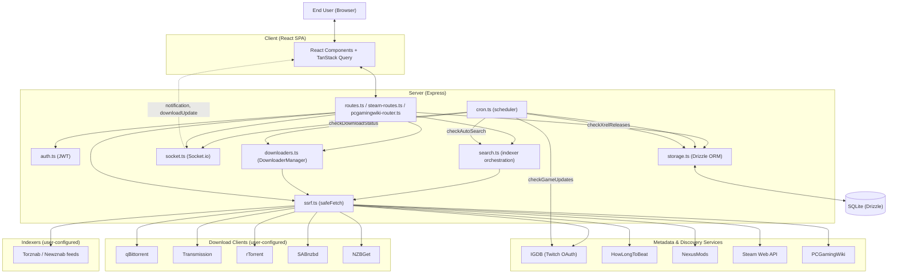
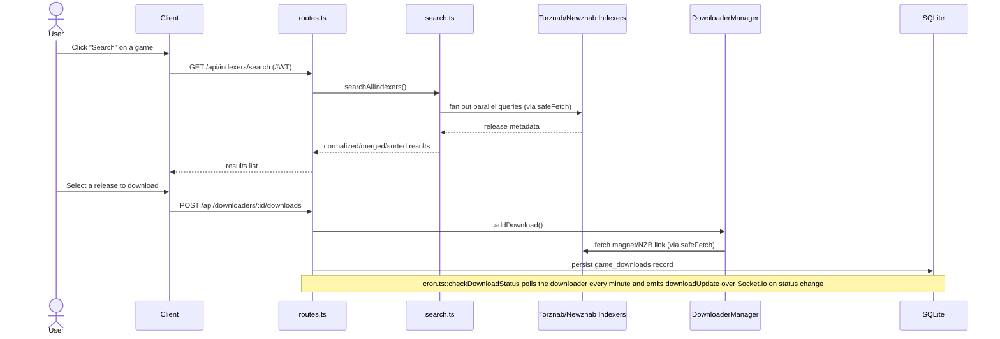

# System Architecture & Actors

This document describes Questarr's system design: the actors (subsystems and
external entities that can influence one another) and the data flows between
them. It complements [`CLAUDE.md`](../CLAUDE.md), which covers code-level
conventions rather than system design, and [`docs/API.md`](API.md) /
[`docs/SECURITY_ASSESSMENT.md`](SECURITY_ASSESSMENT.md), which cover the
external interface and risk-assessment angles of the same system.

**Update policy:** update this document whenever a PR introduces a new actor
(a new external integration, download client, or background job) or changes
how data flows between existing actors.

## 1. Overview

Questarr is a three-layer TypeScript application in a single `package.json`
(not a monorepo):

- **`/client`** — a React 18 single-page app (Wouter routing, TanStack Query
  for server state).
- **`/server`** — an Express REST API plus a Socket.io WebSocket channel.
- **`/shared`** — the Drizzle ORM schema and Zod validation schemas used by
  both sides.

The client never talks to the database, external services, or download
clients directly — every action is mediated by the server, which is the
system's central trust boundary (§8).

## 2. System actors

An "actor" here is any subsystem or entity that can influence another part
of the system — by writing data, triggering a request, or emitting an event.

| Actor                                                                                           | Role                                                 | What it can influence                                                                                              |
| ----------------------------------------------------------------------------------------------- | ---------------------------------------------------- | ------------------------------------------------------------------------------------------------------------------ |
| End User (browser)                                                                              | Initiates all user-facing actions                    | Client SPA, via HTTP requests and Socket.io connection                                                             |
| Client (React SPA)                                                                              | Renders UI, holds a JWT                              | Server, via REST calls with `Authorization: Bearer <JWT>`                                                          |
| Server — routes (`server/routes.ts`, `server/steam-routes.ts`, `server/pcgamingwiki-router.ts`) | Validates input, orchestrates business logic         | Storage layer, downloaders, search, Socket.io                                                                      |
| Server — `auth.ts`                                                                              | Issues/verifies JWTs, hashes passwords               | Storage (`system_config` for the JWT secret), request `req.user`                                                   |
| Server — `storage.ts` (Drizzle ORM)                                                             | Sole writer/reader of the SQLite DB                  | SQLite database                                                                                                    |
| SQLite database                                                                                 | Persists all app state                               | Read by every server module via `storage.ts`                                                                       |
| Server — `ssrf.ts` (`safeFetch`)                                                                | Validates and pins outbound URLs                     | Every outbound HTTP(S) call to indexers, downloaders, and most metadata services                                   |
| Server — `cron.ts` (scheduler)                                                                  | Runs unattended background jobs                      | Storage, IGDB, indexers (via `search.ts`), downloaders, Socket.io                                                  |
| Server — `socket.ts` (Socket.io)                                                                | Pushes real-time events                              | Client SPA (broadcast to all connected sockets)                                                                    |
| Server — `search.ts`                                                                            | Orchestrates indexer search, applies filtering/dedup | Torznab/Newznab indexers (read), routes/cron (results)                                                             |
| Server — `downloaders.ts` (`DownloaderManager`)                                                 | Abstracts the 5 download-client integrations         | qBittorrent/Transmission/rTorrent/SABnzbd/NZBGet (write: submit; read: status)                                     |
| IGDB (via Twitch OAuth)                                                                         | External game-metadata provider                      | Server, via `server/igdb.ts` (through `safeFetch`) — read-only queries; also drives `cron.ts::checkGameUpdates`    |
| HowLongToBeat                                                                                   | External gameplay-length provider                    | Server, via `server/hltb.ts` (through `safeFetch`)                                                                 |
| NexusMods                                                                                       | External mod-listing provider                        | Server, via `server/nexusmods.ts` (through `safeFetch`)                                                            |
| Steam Web API                                                                                   | External wishlist provider                           | Server, via `server/steam.ts` / `server/steam-routes.ts` (through `safeFetch`), keyed by user-supplied `steamId64` |
| PCGamingWiki                                                                                    | External wiki-lookup provider                        | Server, via `server/pcgamingwiki-router.ts` (through `safeFetch`), keyed by Steam App ID                           |
| Torznab/Newznab indexers (user-configured)                                                      | External release-search providers                    | Server, via `search.ts` (through `safeFetch`); user-supplied URL/API key                                           |
| qBittorrent / Transmission / rTorrent / SABnzbd / NZBGet (user-configured)                      | External download clients                            | Server, via `downloaders.ts` (through `safeFetch`); user-supplied host/credentials                                 |
| xREL.to                                                                                         | External scene-release monitor                       | Server, via `server/xrel.ts`, driven by `cron.ts::checkXrelReleases`                                               |

## 3. High-level data flow

## 4. Example flow: search, select a release, download

## 5. Request/response flow

Every REST call follows the same path: **Client → routes (`server/routes.ts`
et al., validated via `express-validator`/Zod) → `storage.ts` (Drizzle ORM
queries against `shared/schema.ts`) → JSON response.** Routes never touch
the database directly — all reads/writes go through `storage.ts`, which is
the only module importing the Drizzle `db` client for application data.

## 6. Out-of-band channel: Socket.io

`server/socket.ts` exposes a single `notifyUser(type, payload)` function
(`server/socket.ts:42-46`) that calls `io.emit(type, payload)` — a broadcast
to every connected socket, with no per-user rooms (a `TODO` in `cron.ts`
notes this should be scoped to per-user rooms once multi-user socket auth is
wired up — see `server/cron.ts:534,583`). Two event types are emitted today:

- `"notification"` — emitted from both `cron.ts` (game updates, download
  completion, auto-search results, xREL matches) and `routes.ts`; consumed by
  `client/src/components/NotificationCenter.tsx`.
- `"downloadUpdate"` — emitted from `cron.ts::checkDownloadStatus` whenever a
  tracked download's status changes; consumed by
  `client/src/components/GameDetailsModal.tsx` to refresh download state for
  the affected game.

## 7. Scheduled/background actors (cron jobs)

`server/cron.ts::startCronJobs()` schedules five recurring jobs via
`setInterval`, each also run once on an initial 10-second delayed startup:

| Job                   | Interval                                                                                  | Upstream read                                                                           | Downstream write                                                                                                 |
| --------------------- | ----------------------------------------------------------------------------------------- | --------------------------------------------------------------------------------------- | ---------------------------------------------------------------------------------------------------------------- |
| `checkGameUpdates`    | 24 hours                                                                                  | IGDB (batch fetch by ID)                                                                | `games` table (release date/status), `notifications` table, Socket.io `notification`                             |
| `checkDownloadStatus` | 1 minute                                                                                  | Configured download clients (via `DownloaderManager`)                                   | `game_downloads`/`games` status, `notifications`, Socket.io `downloadUpdate`/`notification`                      |
| `checkAutoSearch`     | 1 hour (per user, gated by their configured search interval)                              | Torznab/Newznab indexers (via `search.ts`), download clients (if auto-download enabled) | `games` search-results flag, `game_downloads`, `notifications`, Socket.io `notification`                         |
| `checkXrelReleases`   | 6 hours                                                                                   | xREL.to latest releases                                                                 | `xrel_notified_releases`, `notifications`, Socket.io `notification`                                              |
| `checkSteamWishlist`  | 1 hour (per user, gated by their configured sync interval, opt-in via `steamSyncEnabled`) | Steam Web API wishlist, IGDB (Steam App ID lookup)                                      | `games` table (new/linked entries), `import_tasks`, `notifications`, Socket.io `importTaskUpdate`/`notification` |

Steam wishlist sync (`syncUserSteamWishlist` in `server/cron.ts`) also runs
on-demand when a user explicitly triggers it via
`POST /api/steam/wishlist/sync` (`server/steam-routes.ts:37-56`). The
scheduled path is opt-in per user (`userSettings.steamSyncEnabled`, default
`false`) with a configurable interval (`userSettings.steamSyncIntervalHours`,
default 24) tracked via `userSettings.lastSteamSync`.

## 8. Trust boundaries

- **Browser ↔ Server** is the primary trust boundary. The client is treated
  as fully untrusted; every write path is re-validated server-side
  (`express-validator`/Zod) regardless of client-side checks, and all
  non-public routes require a valid JWT (`authenticateToken`,
  `server/auth.ts:104-126`).
- **Server ↔ third-party services** is a secondary boundary, mediated by
  `server/ssrf.ts::safeFetch` for outbound calls whose target host is wholly
  or partly user-supplied (indexers, download clients, HowLongToBeat,
  NexusMods, Steam, PCGamingWiki). `safeFetch` blocks link-local/cloud-
  metadata/broadcast ranges unconditionally, and re-validates every resolved
  IP to guard against DNS rebinding (`server/ssrf.ts:4-18,181-249`).
  `allowPrivate` defaults to `true` (`server/ssrf.ts:19-22,86`), i.e. private/
  loopback ranges are reachable by design — Questarr is meant to be
  self-hosted alongside indexers/downloaders that often live on the same
  LAN.
- `server/igdb.ts` also routes its Twitch/IGDB requests through `safeFetch`,
  consistent with every other integration, even though the target host
  (`api.igdb.com`/`id.twitch.tv`) is hardcoded rather than user-supplied —
  applied as defense in depth rather than out of SSRF necessity.

See [`docs/THREAT_MODEL.md`](THREAT_MODEL.md) for a more detailed attack-surface
analysis of these trust boundaries (per-integration trust table, high-risk
data flows, and the unauthenticated-route inventory).
