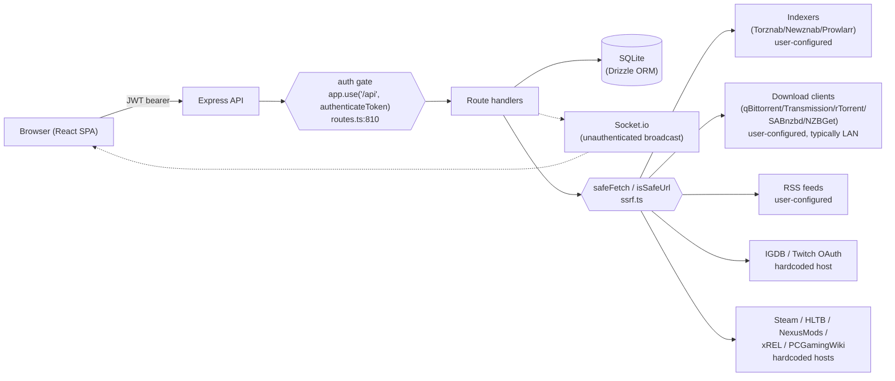

# Questarr — Threat Model & Attack Surface Analysis

**Version:** 1.0
**Date:** 2026-07-01
**Last reviewed:** 2026-07-01
**Author:** Doezer
**Audience:** Maintainers, contributors, security reviewers

---

## 1. Purpose & Scope

This document is Questarr's attack-surface analysis, satisfying [OpenSSF Baseline
OSPS-SA-03.02](https://baseline.openssf.org/): it identifies critical code paths, trust
boundaries, and external interactions, and records how each threat is mitigated or
knowingly accepted.

**In scope:** the Express API and its route handlers, the React client, the SQLite/Drizzle
data layer, Socket.io realtime channel, and every external service Questarr talks to
(indexers, download clients, IGDB, Steam, HowLongToBeat, NexusMods, xREL, PCGamingWiki).

**Out of scope:** OS/host hardening, reverse proxy/TLS termination, and Docker deployment
configuration — those are covered by [`.github/SECURITY.md`](../.github/SECURITY.md)'s
deployment security guide.

**Maintenance rule:** update this document whenever a change adds a new external
integration, a new trust boundary, a new unauthenticated route, or materially changes
authentication/authorization behavior. This is enforced as part of the security-relevant
test policy in [`.github/CONTRIBUTING.md`](../.github/CONTRIBUTING.md). Bump the "Last
reviewed" date above whenever this document is revisited, even if no changes are needed —
a stale date is the signal that a review is overdue.

---

## 2. System Overview & Trust Boundaries

Four named trust boundaries:

1. **Browser ↔ Server** — JWT bearer auth (`server/auth.ts`). Once authenticated, a user has
   full access to their own resources; there is no admin/non-admin split (see Section 8,
   "flat trust model" — an accepted design tradeoff, not a gap).
2. **Server ↔ SQLite** — fully trusted; all access is parameterized via Drizzle ORM.
3. **Server ↔ user-configured external hosts** (indexers, download clients, RSS feeds) —
   **the highest-risk boundary**. A user (or a compromised/malicious indexer response) can
   point the server at an arbitrary host, including internal LAN services. This is the
   primary reason `server/ssrf.ts` exists.
4. **Server ↔ hardcoded external APIs** (IGDB, Steam, HLTB, NexusMods, xREL, PCGamingWiki) —
   lower risk since hosts aren't user-supplied, but responses are still untrusted data, and
   `safeFetch`/`isSafeUrl` is applied as defense in depth regardless.

---

## 3. Assets

- **Credentials:** user password hashes, the JWT signing secret, indexer API keys,
  download-client passwords, the NexusMods API key.
- **Library/download metadata:** game collections, download history — low sensitivity, but
  cross-user leakage is a privacy concern (see Socket.io note in Section 8).
- **Server availability:** self-hosted, typically on a home server/NAS — denial of service
  matters more here than in a scaled cloud deployment.
- **The host LAN:** the top SSRF concern. Download clients are frequently on the same
  network as other unauthenticated home-lab services; inducing the server to make requests
  to arbitrary internal hosts is the most damaging class of attack against this app.

---

## 4. High-Risk Data Flows

### 4.1 Indexer search → download client

Search query → indexer (Torznab/Newznab/Prowlarr, user-configured URL) → parsed result
(payload URLs from the indexer's response, untrusted) → `isSafeUrl()` check → `safeFetch()`
to retrieve the `.torrent`/`.nzb` payload → handed to the download client.

Mitigations:

- `server/ssrf.ts` `isSafeUrl()`/`safeFetch()` — DNS-rebinding-safe resolution (validates
  every resolved IP, not just the first), blocks cloud metadata ranges.
- `server/downloaders.ts:333,970,1893,3439,4057` — `isSafeUrl()` gate before fetching a
  release's payload URL; `:3447,4063` — `safeFetch()` for the actual NZB fetch.
- `server/torznab.ts:69,446` and `server/newznab.ts:53,114,311,320,373,382` — indexer
  clients gate search-result URLs the same way before fetching.
- `server/middleware.ts:300,373,427` — `sanitizeDownloaderData`/`sanitizeIndexerData` block
  `..` in user-supplied download paths at write time (see residual risk in Section 8).

Note: raw `fetch()`/RPC calls inside `downloaders.ts` that target the **admin-configured
download client itself** (e.g. the Transmission/qBittorrent control API) are not SSRF-gated,
and don't need to be — that host is the trust anchor the admin explicitly configured, not
attacker-influenced data. Only fetches of indexer-supplied _payload_ URLs are the SSRF
concern, and those are covered above.

### 4.2 IGDB metadata fetch

Server → `id.twitch.tv` (OAuth token) → `api.igdb.com` (game metadata). Both hosts are
hardcoded; credentials come from `system_config`/env (`server/config.ts`).

Mitigations: `igdbRateLimiter` (per-user configurable); `sanitizeSearchQuery`/`sanitizeIgdbId`
in `server/middleware.ts`; as of this document's revision, both calls in `server/igdb.ts`
route through `safeFetch()` (previously used raw `fetch()`, inconsistent with every other
integration — fixed alongside this document, see Section 8).

### 4.3 User-configured RSS / indexer / downloader URLs

A user enters an arbitrary host (RSS feed URL, custom indexer, custom downloader address) at
setup/settings time → stored in SQLite → later fetched by `server/cron.ts`/`server/rss.ts`/the
relevant client.

Mitigations: `sanitizeIndexerData`/`sanitizeDownloaderData` validate at write time; every
fetch re-validates via `isSafeUrl()`/`safeFetch()` at _use_ time too, not just at save time —
this matters because DNS can change between when a URL is saved and when it's next fetched
(classic TOCTOU/rebinding window).

---

## 5. External Integration Trust Table

| Integration                                                         | Host source                    | Auth surface                          | SSRF-checked?                                                                              | Notes                                           |
| ------------------------------------------------------------------- | ------------------------------ | ------------------------------------- | ------------------------------------------------------------------------------------------ | ----------------------------------------------- |
| Indexers (Torznab/Newznab/Prowlarr)                                 | user-configured                | API key (plaintext at rest)           | Yes                                                                                        | highest risk — user-supplied host               |
| Download clients (qBittorrent/Transmission/rTorrent/SABnzbd/NZBGet) | user-configured, typically LAN | username/password (plaintext at rest) | Payload-URL fetches: yes. Control-plane calls to the configured client: N/A (trust anchor) | see 4.1                                         |
| RSS feeds                                                           | user-configured                | none                                  | Yes (`server/rss.ts`)                                                                      |                                                 |
| IGDB / Twitch                                                       | hardcoded                      | client ID/secret (`system_config`)    | Yes (fixed in this revision)                                                               | see 4.2                                         |
| Steam                                                               | hardcoded                      | none (public endpoint)                | Yes (`server/steam.ts`)                                                                    | wishlist import only                            |
| HowLongToBeat                                                       | hardcoded                      | none                                  | Yes (`server/hltb.ts`)                                                                     |                                                 |
| NexusMods                                                           | hardcoded                      | API key (`system_config`)             | Yes (`server/nexusmods.ts`)                                                                |                                                 |
| xREL                                                                | hardcoded allowlist            | none                                  | Yes (`server/xrel.ts`)                                                                     | only `api.xrel.to`/`xrel-api.nfos.to` permitted |
| PCGamingWiki                                                        | hardcoded                      | none                                  | Yes (`server/pcgamingwiki-router.ts`)                                                      |                                                 |

---

## 6. Existing Mitigations Index

This section cross-references controls by category rather than duplicating them — treat the
linked file as the source of truth.

- **SSRF / DNS rebinding:** `server/ssrf.ts` (`isSafeUrl`, `safeFetch`)
- **Input sanitization:** `server/middleware.ts` (`sanitizeSearchQuery`, `sanitizeGameId`,
  `sanitizeDownloadId`, `sanitizeIgdbId`, `sanitizeGameData`, `sanitizeIndexerData`,
  `sanitizeDownloaderData`, `sanitizeIndexerSearchQuery`)
- **Rate limiting:** `server/middleware.ts` (`igdbRateLimiter`, `authRateLimiter`,
  `sensitiveEndpointLimiter`, `generalApiLimiter`); `server/index.ts:34` (global mount)
- **Authentication/session:** `server/auth.ts` (JWT issuance/verification); global gate at
  `server/routes.ts:810`
- **SQL injection:** not applicable by construction — Drizzle ORM parameterizes all
  application queries; the only raw SQL (`sql.raw`/`sql` template literals in
  `server/migrate.ts`) is hardcoded migration DDL with no user input.
- **Secrets scanning / dependency hygiene:** `.github/workflows/ci.yml` (`secretlint`),
  `.github/dependabot.yml`
- **SBOM:** [`docs/SBOM.md`](./SBOM.md) — Syft-generated, attached to Docker releases
- **Disclosure process / access governance:** [`.github/SECURITY.md`](../.github/SECURITY.md)
- **Test coverage:** `server/__tests__/ssrf.test.ts`, `ssrf_routes.test.ts`,
  `rss-ssrf.test.ts`, `downloaders_ssrf.test.ts`, `security.test.ts`,
  `security_error_handling.test.ts`, `auth-setup-ratelimit.test.ts`

---

## 7. Unauthenticated Surface

`server/routes.ts:810` registers `app.use("/api", authenticateToken)`, which gates every
route registered **after** that line. The routes below are registered **before** it and are
the actual unauthenticated surface:

| Route                                                | Rate-limited?                                   | Justification                                                                                         |
| ---------------------------------------------------- | ----------------------------------------------- | ----------------------------------------------------------------------------------------------------- |
| `GET /api/auth/status`                               | no                                              | Returns whether initial setup is complete; no sensitive data.                                         |
| `POST /api/auth/setup`                               | yes (`authRateLimiter`, added in this revision) | Creates the first admin account; short-circuits with 403 once a user exists.                          |
| `POST /api/auth/login`                               | yes (`authRateLimiter`)                         | Standard login brute-force protection.                                                                |
| `GET /api/auth/me`                                   | n/a                                             | Has explicit `authenticateToken` despite being registered before the gate.                            |
| `GET /api/health`                                    | no                                              | Intentionally public liveness check.                                                                  |
| `GET`/`PATCH /api/settings/ssl`, SSL generate/upload | n/a                                             | Each has explicit `authenticateToken`.                                                                |
| `GET /api/system/filesystem`                         | n/a (`sensitiveEndpointLimiter`)                | Has explicit `authenticateToken`; scoped to `FILE_BROWSER_ROOT` with path-resolution + prefix checks. |
| `GET /api/config`                                    | yes (`sensitiveEndpointLimiter`)                | Intentionally public — returns only an IGDB-configured boolean and the xREL API base URL.             |

No route here exposes user data or performs a state-changing action without either explicit
authentication or a narrowly-scoped, low-sensitivity response.

---

## 8. Residual & Accepted Risks

| Risk                                                                                                                                                                                                             | Status                                    | Rationale                                                                                                                                                                                                                                                                                                               |
| ---------------------------------------------------------------------------------------------------------------------------------------------------------------------------------------------------------------- | ----------------------------------------- | ----------------------------------------------------------------------------------------------------------------------------------------------------------------------------------------------------------------------------------------------------------------------------------------------------------------------- |
| `igdb.ts` bypassed `safeFetch`, used raw `fetch()` to hardcoded hosts                                                                                                                                            | **Fixed in this change**                  | Migrated both the Twitch OAuth call and the IGDB API call to `safeFetch()` for consistency with every other integration (defense in depth, since hosts are currently hardcoded and not user-influenceable).                                                                                                             |
| `/api/auth/setup` had no rate limiter                                                                                                                                                                            | **Fixed in this change**                  | Added `authRateLimiter`, matching `/api/auth/login`.                                                                                                                                                                                                                                                                    |
| Indexer API keys, downloader passwords, NexusMods API key, and an auto-generated JWT secret are stored in plaintext in SQLite                                                                                    | **Accepted risk**                         | Questarr is a self-hosted, single-machine deployment model; database file access already implies host compromise. Revisit if a hosted/multi-tenant deployment model is ever pursued.                                                                                                                                    |
| Socket.io (`server/socket.ts`) has no per-connection authentication; `notifyUser()` broadcasts via plain `io.emit()` to every connected client regardless of which user owns the event                           | **Recommended follow-up**                 | Connections are restricted to configured origins (CORS), so this is a same-install, cross-account metadata leak (e.g. one user seeing another's download progress), not an externally exposed one. Low severity given current single-tenant-ish usage; worth scoping if multi-user usage grows. File a follow-up issue. |
| Path-traversal checks in `sanitizeDownloaderData`/`sanitizeIndexerData` use a `!value.includes("..")` blocklist rather than the resolve-and-prefix-check pattern `server/routes.ts`'s file-browser endpoint uses | **Recommended follow-up**                 | Downstream consumers don't currently perform direct filesystem access with these values, so risk is low; migrating to the stronger pattern is still worthwhile for consistency. File a follow-up issue.                                                                                                                 |
| No CodeQL/SAST and no container image scanning (Trivy/Grype) in CI — only `secretlint` + Dependabot                                                                                                              | **Recommended follow-up**                 | Not bundled with this document because it's a CI infrastructure change deserving its own review (tool choice, false-positive tuning, gating vs. advisory). File a follow-up issue against `.github/workflows/ci.yml`.                                                                                                   |
| Flat, single-tier trust model — an authenticated user has full access with no RBAC/admin split                                                                                                                   | **Accepted risk / documented assumption** | Deliberate simplicity tradeoff for a small, self-hosted, multi-user app.                                                                                                                                                                                                                                                |

---

## 9. Review Cadence

Re-review triggers, rather than a calendar chore that tends to get skipped:

- A new external integration is added.
- A new unauthenticated route is introduced (i.e., anything registered before the
  `routes.ts:810` gate).
- Authentication/session/authorization behavior changes.
- A major version bump.

Any maintainer or contributor should update this document as part of the PR that triggers
one of the above — see the testing policy in
[`.github/CONTRIBUTING.md`](../.github/CONTRIBUTING.md).
